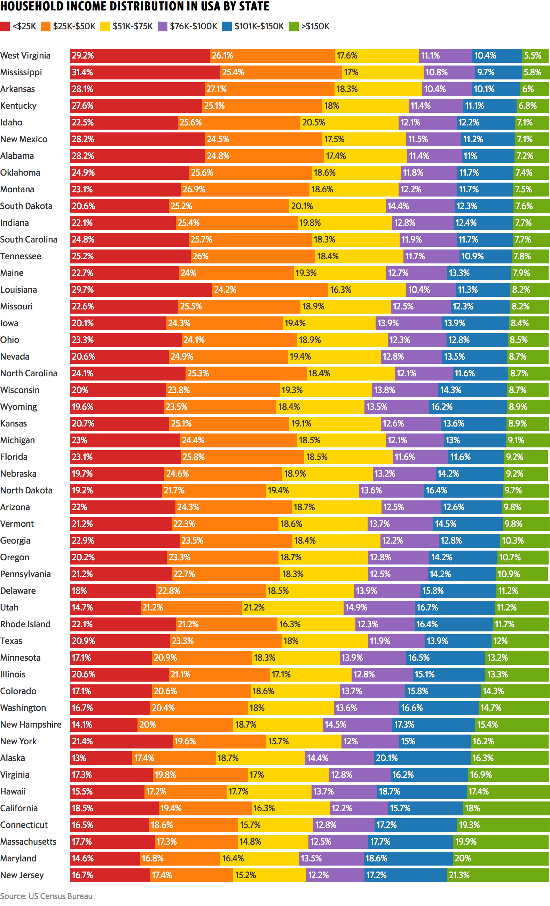
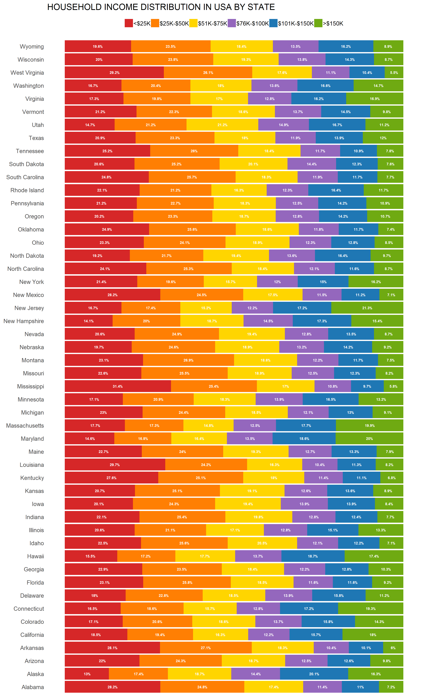
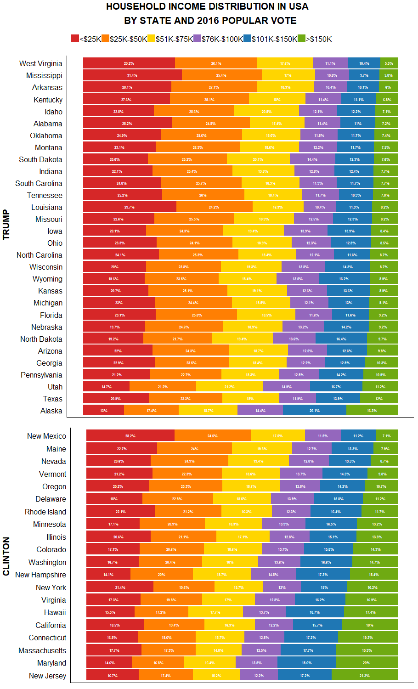

```{r global_options, include = FALSE}
knitr::opts_chunk$set(fig.pos = 'h')
```


## **Objective 1:  Reproduce Original Graph**

The original graph (Fig.\ 1 below) was the 2018 Week 3 challenge on Makeover Monday.  It is a stacked horizontal bar chart depicting US household income distribution by state, broken out into six categories, and organized by order of increasing percentage in the highest income category.

```{r origpng, out.height = "400px", fig.align="center", echo = FALSE}

```

\begin{center}
Figure 1. Original graph.
\end{center}


### Loading Libraries

```{r setup, echo = TRUE, results = "hide", message = FALSE, warning = FALSE}
library(tidyverse)
library(readxl)
library(grid)
library(gridExtra)
```

### Reading in and Subsetting Data

The dataset posted on the Makeover Monday website did not match the original graph - that is, the original graph had different underlying data.  The author of the original graph directed us to the correct dataset for 2016 on the [US Census Bureau's American FactFinder page](https://factfinder.census.gov/bkmk/table/1.0/en/ACS/16_1YR/S1901/0100000US.04000) [@uscensus].  This data was downloaded as `ACS_16_1YR_S1901_with_ann.csv`.

The data was read in, subset to columns and rows of interest, and given sensible column names.

```{r readsubset, eval = FALSE, echo = TRUE}

incomedata <- read_csv("ACS_16_1YR_S1901_with_ann.csv")
incomedata <- incomedata %>% select("GEO.display-label",     # Subset to only the variables of interest
                                    "HC01_EST_VC01",
                                    "HC01_EST_VC02",
                                    "HC01_EST_VC03",
                                    "HC01_EST_VC04",
                                    "HC01_EST_VC05",
                                    "HC01_EST_VC06",
                                    "HC01_EST_VC07",
                                    "HC01_EST_VC08",
                                    "HC01_EST_VC09",
                                    "HC01_EST_VC10",
                                    "HC01_EST_VC11")

colnames(incomedata) <- c("state",                           # GEO.display-label
                          "tot_households",                  # HC01_EST_VC01
                          "Less than $10,000",               # HC01_EST_VC02
                          "$10,000 to $14,999",              # HC01_EST_VC03
                          "$15,000 to $24,999",              # HC01_EST_VC04
                          "$25,000 to $34,999",              # HC01_EST_VC05
                          "$35,000 to $49,999",              # HC01_EST_VC06
                          "$50,000 to $74,999",              # HC01_EST_VC07
                          "$75,000 to $99,999",              # HC01_EST_VC08
                          "$100,000 to $149,999",            # HC01_EST_VC09
                          "$150,000 to $199,999",            # HC01_EST_VC10
                          "$200,000 or more")                # HC01_EST_VC11

incomedata <- incomedata %>% 
  slice(2:n()) %>% 
  filter(state != "Puerto Rico" & state != "District of Columbia")  # Omit PR and DC per original graph
```


### Tidying and Transforming the Data

Next, `gather()` was used to transform the data from wide to long format.

```{r gather, eval = FALSE, echo = TRUE}

incomegat <- incomedata %>% 
  gather(`Less than $10,000`,
         `$10,000 to $14,999`,
         `$15,000 to $24,999`,
         `$25,000 to $34,999`,
         `$35,000 to $49,999`,
         `$50,000 to $74,999`,
         `$75,000 to $99,999`,
         `$100,000 to $149,999`,
         `$150,000 to $199,999`,
         `$200,000 or more`,
         key = "incomelev", value = "pct")
```

Serial `mutate()` calls were used to cast existing variables as numeric values and create income categories consistent with those used in the original graph.  Percentages in each income category were calculated using `group_by()` and `mutate()`, then the dataset was subset to only those variables and rows of interest.

```{r mutate, eval = FALSE, echo = TRUE}

incometbl <- incomegat %>% 
  mutate(tot_households = as.numeric(tot_households)) %>% 
  mutate(pct = as.numeric(pct)) %>% 
  mutate(n_households = round((pct / 100) * tot_households, digits = 0)) %>% 
  mutate(incomecat = case_when(
    incomelev == "Less than $10,000" ~ "<$25K",
    incomelev == "$10,000 to $14,999" ~ "<$25K",
    incomelev == "$15,000 to $24,999" ~ "<$25K",
    incomelev == "$25,000 to $34,999" ~ "$25K-$50K",
    incomelev == "$35,000 to $49,999" ~ "$25K-$50K",
    incomelev == "$50,000 to $74,999" ~ "$51K-$75K",
    incomelev == "$75,000 to $99,999" ~ "$76K-$100K",
    incomelev == "$100,000 to $149,999" ~ "$101K-$150K",
    incomelev == "$150,000 to $199,999" ~ ">$150K",
    incomelev == "$200,000 or more" ~ ">$150K")) %>% 
  mutate(incomecat = factor(incomecat,
                        levels = c("<$25K", 
                                   "$25K-$50K", 
                                   "$51K-$75K", 
                                   "$76K-$100K", 
                                   "$101K-$150K", 
                                   ">$150K"))) %>%
  group_by(state, incomecat) %>% 
  mutate(catpct = sum(pct)) %>% 
  select(state, catpct, incomecat) %>% 
  distinct(state, catpct, incomecat) %>% 
  arrange(desc(incomecat), catpct)
```

The `state` variable was converted to a factor to allow for ordering the graph in the desired manner.

```{r factors, eval = FALSE, echo = TRUE}

incometbl <- within(incometbl,                     # Assign levels for state column
                    state <- factor(state,
                                    levels = rev(incometbl$state[1:50])))
```

### Generating the Reproduced Plot

Finally, the original graph was recreated using the following key components (among others):

* `geom_bar()` to create the stacked bars
* `coord_flip()` to arrange them horizontally
* `scale_fill_manual()` to manually match the colors used in the original graph
* `geom_text()` to add labels indicating the percentage of state households in each income category
* `scale_y_reverse()` to order the income categories from lowest to highest

```{r origplot, eval = FALSE, echo = TRUE}

reprod_plot <- ggplot(incometbl, aes(x = state, y = catpct / 100, 
                                     fill = incomecat, label = catpct)) +
  coord_flip() +    # Put states on vertical axis
  geom_bar(stat = "identity", aes(y = catpct * 100), position = "fill") +
  scale_fill_manual(values = c(     # Match color scheme of original graph
    "<$25K" = "#D62728",
    "$25K-$50K" = "#FF7F03",
    "$51K-$75K" = "#FFD500",
    "$76K-$100K" = "#9467BD",
    "$101K-$150K" = "#1F77B4",
    ">$150K" = "#6FAA12")) +
  geom_text(aes(label = paste0(catpct,"%")),    # Label stacked bars
            size = 2, color = "white", fontface = "bold", 
            hjust = 0.5, position = position_stack(vjust = 0.5)) +
  scale_y_reverse() +    # Ensure <$25K category on left
  theme(axis.text.x = element_blank(),
        axis.ticks = element_blank(),
        axis.title = element_blank(),
        panel.background = element_blank(),
        legend.position = "top",
        legend.title = element_blank(),
        legend.key.width = unit(0.5, "cm"),
        legend.key.height = unit(0.5, "cm")) +
  guides(fill = guide_legend(nrow = 1)) +     # Force all legend elements into one row
  ggtitle("HOUSEHOLD INCOME DISTRIBUTION IN USA BY STATE")
reprod_plot
```

```{r reprodpng, out.height = "500px", fig.align="center", echo = FALSE}

```

\begin{center}
Figure 2. Reproduced graph.
\end{center}

This graph bears minor cosmetic differences from the original graph, but both graphs are functionally the same.  The plot was saved using `ggsave()`.

```{r saveorigplot, eval = FALSE, echo = TRUE}

ggsave("reprod_plot.png", height = 15, width = 9.1, units = "in")
```

Because we were working in parallel using GitHub, the dataset was exported to .csv for use in creating the improved graphs.

```{r exportdata, eval = FALSE, echo = TRUE}

write_csv(incometbl, "incometbl.csv")
```


## **Objective 2:  Create Improved Graphs**


### Merging in Election Results Data

Because the original data was from 2016, we were interested in how the 2016 presidential election popular vote results may be related to income distribution.  Election results data, obtained from the [Federal Election Commission website](https://transition.fec.gov/general/FederalElections2016.shtml) [@fec], were read in using `read_xlsx()`, and the popular vote `winner` was calculated using and converted to a factor using several piped `mutate()` calls.  Factors were also assigned to `state`, consistent with the `incometbl` data, and the percentages of states won by each candidate were calculated.

```{r popvote, eval = FALSE, echo = TRUE}

popvote_raw <- read_xlsx("federalelections2016.xlsx", sheet = "Appendix A", range = "A7:C59")

popvote <- as.tibble(popvote_raw) %>% 
  filter(!is.na(STATE) & STATE != "D.C.") %>% 
  mutate(gop = as.numeric(TRUMP)) %>% 
  mutate(dem = as.numeric(CLINTON)) %>% 
  mutate(winner = case_when(
    dem < gop ~ "R",
    dem > gop ~ "D"
  )) %>% 
  mutate(winner = factor(winner, levels = c("R", "D"))) %>% 
  rename(state = STATE) %>% 
  mutate(state = factor(state, levels = rev(incometbl$state[1:50]))) %>% 
  select(state, winner)

popvote_gop <- popvote %>% filter(winner == "R") %>% count()
weight_gop = popvote_gop / 50
popvote_dem <- popvote %>% filter(winner == "D") %>% count()
weight_dem = popvote_dem / 50
```

The data exported in Objective 1 above (`incometbl.csv`) was reimported and factors were reassigned to the income levels and states (it should be noted that, had we not been working in parallel, this step would not have been necessary).

```{r reimport, eval = FALSE, echo = TRUE}

incometbl_raw <- read_csv("incometbl.csv")

incometbl <- incometbl_raw %>% 
  arrange(desc(incomecat), catpct) %>% 
  mutate(incomecat = factor(incomecat,
                            levels = c("<$25K", 
                                       "$25K-$50K", 
                                       "$51K-$75K", 
                                       "$76K-$100K", 
                                       "$101K-$150K", 
                                       ">$150K"))) %>%
  mutate(state = factor(state, levels = rev(state[1:50])))
```

The two datasets were joined, and the resulting dataset was exported.

```{r joinvote, eval = FALSE, echo = TRUE}

incometbl <- full_join(incometbl, popvote, by = "state")

write_csv(incometbl, "incometbl_vote.csv")    # Export vote-augmented dataset in case Thinh wants it
```


### Separating the Reproduced Graph by Popular Vote

Two graphs were produced in the same manner as in Objective 1, one for the states won by Trump (titled `reprod_plot_gop`), and the other for those won by Clinton (titled `reprod_plot_dem`).  In the interest of brevity, code for these plots will not be shown here, but is available in the [repository](https://github.com/kmprioliPROF/Makeover_Monday) for this project [@kmpgit].  In each plot, a `filter()` statement was used within the `ggplot()` call to subset the data to states won by the party of interest - for example, for Trump:

```{r plotvote, eval = FALSE, echo = TRUE}

reprod_plot_gop <- ggplot(data = filter(incometbl, winner == "R"), 
                          aes(...)) + ...
```

Next, `arrangeGrob()` in the `grid` package was used to annotate each plot with the winner using `textGrob()`, then `grid.arrange()` (from the `gridExtra` package) was used to arrange these two plots vertically and add a title.

```{r gridplotvote, eval = FALSE, echo = TRUE}

plot_gop <- arrangeGrob(reprod_plot_gop, left = textGrob("TRUMP", 
                                                         rot = 90,
                                                         gp = gpar(fontsize = 14, fontface = "bold")))
plot_dem <- arrangeGrob(reprod_plot_dem, left = textGrob("CLINTON", 
                                                         rot = 90,
                                                         gp = gpar(fontsize = 14, fontface = "bold")))

grid.arrange(plot_gop, plot_dem, nrow = 2,
             heights = c(2 * weight_gop, 2 * weight_dem),
             top = textGrob("HOUSEHOLD INCOME DISTRIBUTION IN USA \n BY STATE AND 2016 POPULAR VOTE",
                            gp = gpar(fontsize = 16, fontface = "bold")))

# Note - grid.arrange disables ggsave(), so I manually exported the graph using the Plots tab
```

```{r reprodvotepng, out.height = "500px", fig.align="center", echo = FALSE}

```

\begin{center}
Figure 3. Reproduced graph segmented by 2016 popular vote results.
\end{center}

The most noteworthy trend in this graph was that the states won by Hillary Clinton had a noticeably higher percentage of households in the >$150K income category, whereas those won by Donald Trump had greater percentages in the low- and middle-ranges (<\$25K and \$25-\$50K).


### Creating Choropleths

Another way to visualize this data is by choropleths.

<!--- Continue here --->


## **Full Code**

Full code is available in a [public Github repository](https://github.com/kmprioliPROF/Makeover_Monday) [@kmpgit].


## **References**