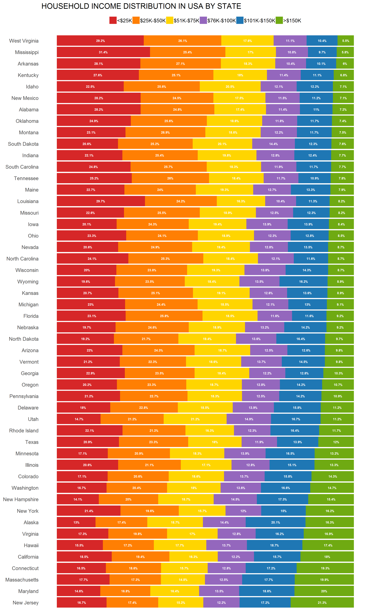
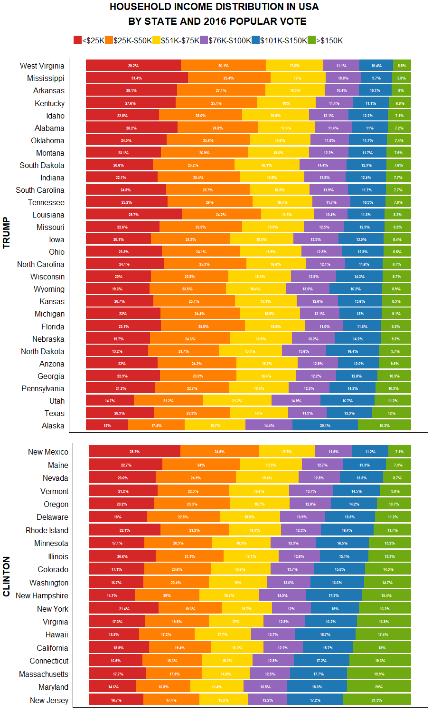

```{r setup, include=FALSE}
knitr::opts_chunk$set(echo = FALSE)
```

<style>
    p { margin-top: -30px; }
</style>

## Original Graph (Makeover Monday 2018, Week 3)

<div style="float: left; width: 38%;">
  
</div>

<div style="float: left; width: 62%;">

The original graph showed household income distribution in the USA by state, broken out into six categories:

  * <$25K
  * $25K-$50K
  * $51K-$75K
  * $75K-$100K
  * $101K-$150K
  * \>$150K

<br> and organized in order of increasing percentage in the >$150K category.

<br> The underlying data comes from the US Census Bureau's [Income in the Past 12 Months](https://factfinder.census.gov/bkmk/table/1.0/en/ACS/16_1YR/S1901/0100000US.04000) data for 2016.

</div>

## Reproduced Graph

<div style="float: left; width: 38%;">
  
</div>

<div style="float: left; width: 62%;">

The reproduced graph is shown here.

<br> Though some cosmetic differences exist between this graph and the original, both graphs are functionally the same.

</div>

## Segmenting by 2016 Presidential Election Results

<div style="float: left; width: 38%;">
  
</div>

<div style="float: left; width: 62%;">
Since these data were from 2016, we were interested in how the 2016 presidential election popular vote results may be related to income distribution.

<br> The most noteworthy trend is that states won by Hillary Clinton had noticeably more households in the >$150K earning category, whereas those won by Donald Trump had greater numbers in the low- and middle-ranges (<\$25K and \$25-\$50K).

<br> Election results data came from the Federal Election Commission's [2016 election results](https://transition.fec.gov/general/FederalElections2016.shtml) page.

<br> Segmenting the plot was accomplished by creating separate plots by winner and using `grid.arrange()` from the `gridExtra` library to arrange them:

<br> 
```
grid.arrange(plot_gop, plot_dem, nrow = 2,
             heights = c(2 * weight_gop, 2 * weight_dem),
             top = textGrob("HOUSEHOLD INCOME DISTRIBUTION IN USA \n 
                             BY STATE AND 2016 POPULAR VOTE",
                            gp = gpar(fontsize = 16, fontface = "bold")))
```
</div>

## Choropleths

<div class="rows-2"
  style="float: left; width: 38%;">
  
  
</div>

<div style="float: right; width: 40%;">
* `state` data from `map` library is merged with income data to create choropleth
* Color segments (percentage) are created from `cut_interval()` function
* Color scheme emphasizes groups across spectrums (as advised from colorbrewer2.org)
* States where Clinton won tend to have higher portion of high income earners and low portion of low income earners while states where Trump won have higher portion low earners and lower portion of high earners
</div>


## Challenges

* Dataset hosted on Makeover Monday did not match the original graph
    * Required getting raw data from US Census website
* Raw data required nontrivial wrangling, including use of `gather()` and `mutate()` to match categories in original graph:

<div style="float: left; width: 40%;">
```
gather(`Less than $10,000`,
       `$10,000 to $14,999`,
       `$15,000 to $24,999`,
       `$25,000 to $34,999`,
       `$35,000 to $49,999`,
       `$50,000 to $74,999`,
       `$75,000 to $99,999`,
       `$100,000 to $149,999`,
       `$150,000 to $199,999`,
       `$200,000 or more`,
       key = "incomelev", value = "pct")
```
</div>

<div style="float: left; width: 10%;">

<br><br><br><br> and 

</div>

<div style="float: left; width: 40%;">

```
mutate(incomecat = case_when(
    incomelev == "Less than $10,000" ~ "<$25K",
    incomelev == "$10,000 to $14,999" ~ "<$25K",
    incomelev == "$15,000 to $24,999" ~ "<$25K",
    incomelev == "$25,000 to $34,999" ~ "$25K-$50K",
    incomelev == "$35,000 to $49,999" ~ "$25K-$50K",
    incomelev == "$50,000 to $74,999" ~ "$51K-$75K",
    incomelev == "$75,000 to $99,999" ~ "$76K-$100K",
    incomelev == "$100,000 to $149,999" ~ "$101K-$150K",
    incomelev == "$150,000 to $199,999" ~ ">$150K",
    incomelev == "$200,000 or more" ~ ">$150K"))
```
</div>

<div style = "float: left; width: 100%">

* Reproducing the original graph required ordering it by increasing percentage within `incomelev == ">$150K"`
    - We did this by assigning factors to the states:

```
incometbl <- within(incometbl, state <- factor(state, levels = rev(incometbl$state[1:50])))
```
</div>

## More Challenges

<div>
* Incorporation of version control to the project
</div>

<div>
* What aspect of the story to tell and how to show
</div>

<div>
* Artistic/stylistic aspects of data viz
</div>


<!--- Any challenges and code for Thinh's work go here --->

## Code

All code for this project is available on GitHub at [https://github.com/kmprioliPROF/Makeover_Monday](https://github.com/kmprioliPROF/Makeover_Monday).  Feel free to fork the repo if you're interested!

<br><br><br>

<div style="float: left; width: 43%;">
<center>

</center>
</div>

<div style="float: left; width: 15%;">
<br>
</div>

<div style="float: left; width: 42%;">
<center>

</center>
</div>


## Questions?