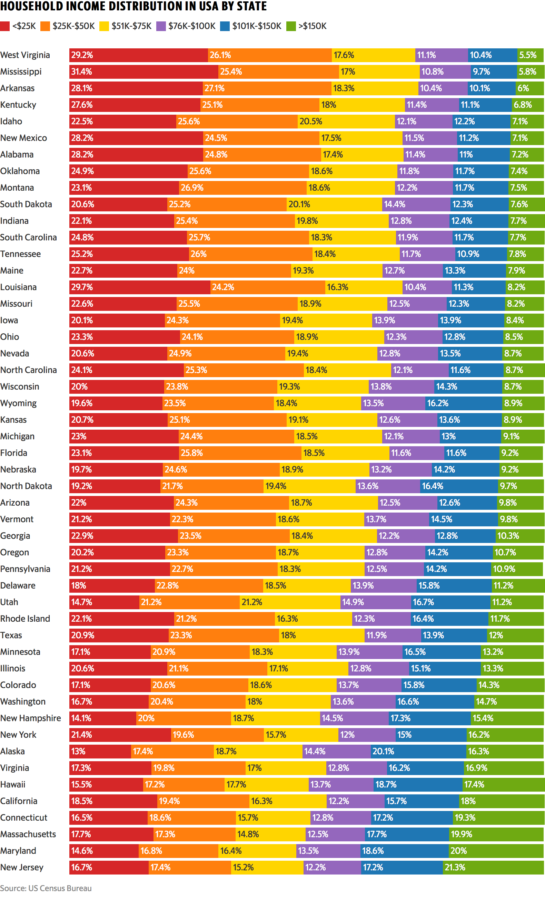

```{r setup, include=FALSE}
knitr::opts_chunk$set(echo = FALSE)
```

## Original Graph

<div class="columns-2">
  
  
The original graph showed household income distribution in the USA by state, broken out into five categories:

* <$25K
* $25K-$50K
* $51K-$75K
* $75K-$100K
* $101K-$150K
* \>$150K

The underlying data comes from the US Census Bureau's [Income in the Past 12 Months](https://factfinder.census.gov/bkmk/table/1.0/en/ACS/16_1YR/S1901/0100000US.04000) data for 2016.

## Reproduced Graph

<div class="columns-2">
  

The reproduced graph is shown here.

Though some cosmetic differences exist between this graph and the original, both graphs are functionally the same.

## Improved Graph

Image and explanatory text go here for the new graph

## Discussion

Placeholder for discussion about coding choices or challenges

```{r cars, echo = TRUE}
summary(cars)
```

## Code

All code for this project is available on GitHub at [https://github.com/kmprioliPROF/Makeover_Monday](https://github.com/kmprioliPROF/Makeover_Monday).  Feel free to fork the repo if you're interested!